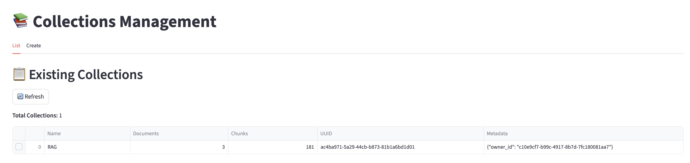
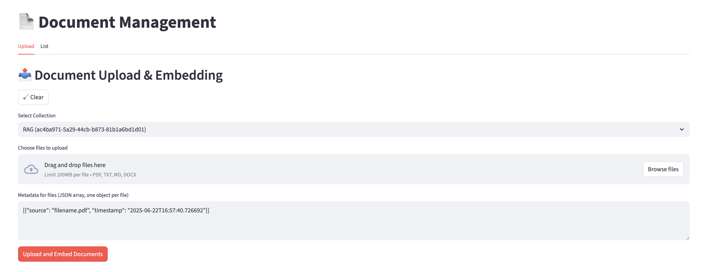
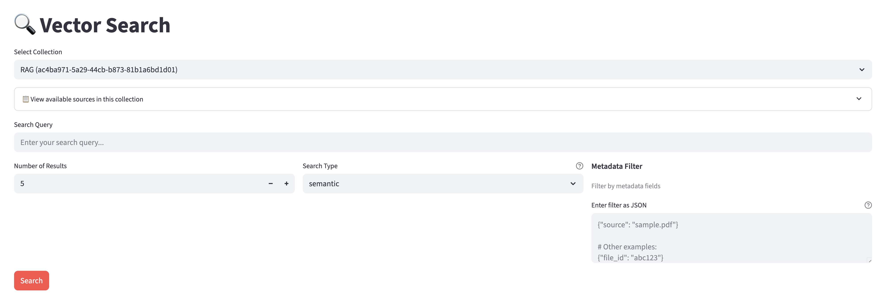

# LangConnect-Client


LangConnect-Client is a comprehensive RAG (Retrieval-Augmented Generation) client application built with Streamlit. It provides a user-friendly interface for interacting with the LangConnect API, enabling document management and vector search capabilities powered by PostgreSQL with pgvector extension.

> Collections


> Documents Management


> Vector Search


## 📋 Table of Contents

- [Features](#features)
- [Architecture](#architecture)
- [Getting Started](#getting-started)
  - [Prerequisites](#prerequisites)
  - [Running with Docker](#running-with-docker)
  - [Development Setup](#development-setup)
- [API Documentation](#api-documentation)
  - [Authentication](#authentication)
  - [Collections](#collections)
  - [Documents](#documents)
  - [Search](#search)
- [Streamlit Application](#streamlit-application)
  - [Main Features](#main-features)
  - [Pages Overview](#pages-overview)
  - [Authentication Persistence](#authentication-persistence)
- [MCP (Model Context Protocol) Server](#mcp-model-context-protocol-server)
  - [Available Tools](#available-tools)
  - [Configuration](#configuration)
  - [Usage with Claude Desktop](#usage-with-claude-desktop)
- [Environment Variables](#environment-variables)
- [Testing](#testing)
- [Security](#security)
- [License](#license)

## Features

- **🚀 FastAPI-based REST API** with automatic documentation
- **🔐 Supabase Authentication** for secure user management
- **🐘 PostgreSQL with pgvector** for efficient vector storage and similarity search
- **📄 Multi-format Document Support** (PDF, TXT, MD, DOCX)
- **🔍 Advanced Search Capabilities**:
  - Semantic search (vector similarity)
  - Keyword search (full-text)
  - Hybrid search (combination of both)
  - Metadata filtering
- **🎨 Streamlit Web Interface** for easy interaction
- **🤖 MCP Server Integration** for AI assistant tools
- **🐳 Docker Support** for easy deployment

## Architecture

```
┌─────────────────┐     ┌──────────────────┐     ┌─────────────────┐
│   Streamlit UI  │────▶│  FastAPI Server  │────▶│   PostgreSQL    │
│   (Frontend)    │     │  (Backend API)   │     │   + pgvector    │
└─────────────────┘     └──────────────────┘     └─────────────────┘
                               │
                               ▼
                        ┌──────────────────┐
                        │   Supabase Auth  │
                        └──────────────────┘
```

## 🚀 Quick Start

Get up and running in just 3 steps:

```bash
# 1. Clone the repository
git clone https://github.com/teddynote-lab/LangConnect-Client.git
cd LangConnect-Client

# 2. Copy environment variables and configure
cp .env.example .env
# Edit .env file to add your SUPABASE_URL and SUPABASE_KEY

# 3. Start all services
docker compose up -d
```

Once started, you can access:
- 🎨 **Streamlit UI**: http://localhost:8501
- 📚 **API Documentation**: http://localhost:8080/docs
- 🔍 **Health Check**: http://localhost:8080/health

To stop all services:
```bash
docker compose down
```

## Getting Started

### Prerequisites

- Docker and Docker Compose
- Python 3.11 or higher
- Supabase account (for authentication)

### Running with Docker

1. Clone the repository:
   ```bash
   git clone https://github.com/teddynote-lab/LangConnect-Client.git
   cd LangConnect-Client
   ```

2. Create a `.env` file with your configuration:
   ```bash
   # Supabase Configuration
   SUPABASE_URL=https://your-project.supabase.co
   SUPABASE_KEY=your-anon-key
   
   # Database Configuration
   POSTGRES_HOST=postgres
   POSTGRES_PORT=5432
   POSTGRES_USER=postgres
   POSTGRES_PASSWORD=postgres
   POSTGRES_DB=postgres
   
   # Authentication
   IS_TESTING=false  # Set to true to disable authentication
   ```

3. Start the services:
   ```bash
   docker-compose up -d
   ```

   This will start:
   - PostgreSQL database with pgvector extension
   - LangConnect API service on http://localhost:8080
   - Streamlit UI on http://localhost:8501

4. Access the services:
   - API documentation: http://localhost:8080/docs
   - Streamlit UI: http://localhost:8501
   - Health check: http://localhost:8080/health

### Development Setup

For local development without Docker:

1. Install dependencies:
   ```bash
   pip install -r requirements.txt
   ```

2. Start PostgreSQL with pgvector (or use Docker for just the database):
   ```bash
   docker-compose up -d postgres
   ```

3. Run the API server:
   ```bash
   uvicorn langconnect.server:app --reload --host 0.0.0.0 --port 8080
   ```

4. Run the Streamlit app:
   ```bash
   streamlit run Main.py
   ```

## API Documentation

The API provides comprehensive endpoints for managing collections and documents. Full interactive documentation is available at http://localhost:8080/docs when the service is running.

### Authentication

All API endpoints (except `/health` and `/auth/*`) require authentication when `IS_TESTING=false`.

#### Authentication Endpoints

| Method | Endpoint | Description | Request Body |
|--------|----------|-------------|--------------|
| POST | `/auth/signup` | Create a new user account | `{"email": "user@example.com", "password": "password123"}` |
| POST | `/auth/signin` | Sign in with existing account | `{"email": "user@example.com", "password": "password123"}` |
| POST | `/auth/signout` | Sign out (client-side cleanup) | - |
| POST | `/auth/refresh` | Refresh access token | Query param: `refresh_token` |
| GET | `/auth/me` | Get current user info | - (requires auth) |

Include the access token in requests:
```
Authorization: Bearer your-access-token
```

### Collections

Collections are containers for organizing related documents.

| Method | Endpoint | Description | Request Body |
|--------|----------|-------------|--------------|
| GET | `/collections` | List all collections | - |
| POST | `/collections` | Create a new collection | `{"name": "collection-name", "metadata": {}}` |
| GET | `/collections/{collection_id}` | Get collection details | - |
| PATCH | `/collections/{collection_id}` | Update collection | `{"name": "new-name", "metadata": {}}` |
| DELETE | `/collections/{collection_id}` | Delete collection | - |

### Documents

Documents are stored as chunks with embeddings for efficient search.

| Method | Endpoint | Description | Parameters |
|--------|----------|-------------|------------|
| GET | `/collections/{collection_id}/documents` | List documents | `limit`, `offset` |
| POST | `/collections/{collection_id}/documents` | Upload documents | Form data: `files[]`, `metadatas_json` |
| DELETE | `/collections/{collection_id}/documents/{document_id}` | Delete document | Query param: `delete_by` (document_id/file_id) |

### Search

Advanced search capabilities within collections.

| Method | Endpoint | Description | Request Body |
|--------|----------|-------------|--------------|
| POST | `/collections/{collection_id}/documents/search` | Search documents | `{"query": "search text", "limit": 10, "search_type": "semantic", "filter": {}}` |

Search types:
- `semantic`: Vector similarity search using embeddings
- `keyword`: Traditional full-text search
- `hybrid`: Combination of semantic and keyword search

Filter example:
```json
{
  "query": "machine learning",
  "limit": 5,
  "search_type": "hybrid",
  "filter": {
    "source": "research_paper.pdf",
    "type": "academic"
  }
}
```

## Streamlit Application

The Streamlit application provides a user-friendly web interface for interacting with the LangConnect API.

### Main Features

- **User Authentication**: Sign up, sign in, and persistent sessions
- **Collections Management**: Create, view, and delete collections
- **Document Upload**: Batch upload documents with metadata
- **Document Management**: View, search, and delete documents
- **Advanced Search**: Semantic, keyword, and hybrid search with filters
- **API Testing**: Built-in API tester for development

### Pages Overview

1. **Main.py** - Landing page with project overview and navigation
   - Project information and features
   - Quick links to all pages
   - User authentication status

2. **Collections Page** (`pages/1_Collections.py`)
   - **List Tab**: View all collections with document/chunk counts
   - **Create Tab**: Create new collections with metadata
   - Multi-select for bulk deletion
   - Automatic statistics calculation

3. **Documents Page** (`pages/2_Documents.py`)
   - **Upload Tab**: 
     - Batch file upload (PDF, TXT, MD, DOCX)
     - Automatic metadata generation
     - Custom metadata support
   - **List Tab**:
     - View all documents with chunk preview
     - Source statistics summary
     - Multi-select for deletion
     - Character count display

4. **Search Page** (`pages/3_Search.py`)
   - Collection selection
   - Search type selection (semantic/keyword/hybrid)
   - Metadata filtering with JSON
   - Result display with relevance scores
   - Source preview for filtering

5. **API Tester Page** (`pages/4_API_Tester.py`)
   - Interactive API endpoint testing
   - Grouped by functionality
   - Request/response visualization
   - Authentication token management

### Authentication Persistence

The Streamlit app supports persistent authentication through:

1. **Automatic File-Based Storage** (Default)
   - Tokens saved to `~/.langconnect_auth_cache`
   - Valid for 7 days
   - Automatically loads on restart

2. **Environment Variables** (Optional)
   ```bash
   LANGCONNECT_TOKEN=your-access-token
   LANGCONNECT_EMAIL=your-email@example.com
   ```

## MCP (Model Context Protocol) Server

LangConnect includes an MCP server that allows AI assistants like Claude to interact with your document collections programmatically.

### Available Tools

The MCP server provides 10 tools for comprehensive document management:

1. **search_documents** - Perform semantic, keyword, or hybrid search
2. **list_collections** - List all available collections
3. **get_collection** - Get details about a specific collection
4. **create_collection** - Create a new collection
5. **update_collection** - Update collection name or metadata
6. **delete_collection** - Delete a collection and its documents
7. **list_documents** - List documents in a collection
8. **add_documents** - Add text documents with metadata
9. **delete_document** - Delete specific documents
10. **get_health_status** - Check API health

### Configuration

The MCP server configuration is defined in `mcp/mcp_config.json`:

```json
{
  "mcpServers": {
    "langconnect-rag-mcp": {
      "command": "/path/to/python",
      "args": [
        "/path/to/langconnect/mcp/mcp_langconnect_server.py"
      ],
      "env": {
        "API_BASE_URL": "http://localhost:8080",
        "API_TOKEN": "your-auth-token"
      }
    }
  }
}
```

### Usage with Claude Desktop

1. Update the configuration file with your paths and authentication token
2. Add the configuration to Claude Desktop's MCP settings
3. Claude will have access to all LangConnect tools for document management and search

Example usage in Claude:
- "Search for documents about machine learning in my research collection"
- "Create a new collection called 'Project Documentation'"
- "List all documents in the technical-specs collection"

## Environment Variables

| Variable | Description | Default | Required |
|----------|-------------|---------|----------|
| **Authentication** |
| SUPABASE_URL | Supabase project URL | - | Yes |
| SUPABASE_KEY | Supabase anon key | - | Yes |
| IS_TESTING | Disable authentication for testing | false | No |
| LANGCONNECT_TOKEN | Persistent auth token | - | No |
| LANGCONNECT_EMAIL | Persistent auth email | - | No |
| **Database** |
| POSTGRES_HOST | PostgreSQL host | postgres | No |
| POSTGRES_PORT | PostgreSQL port | 5432 | No |
| POSTGRES_USER | PostgreSQL username | postgres | No |
| POSTGRES_PASSWORD | PostgreSQL password | postgres | No |
| POSTGRES_DB | PostgreSQL database name | postgres | No |
| **API** |
| API_BASE_URL | API base URL | http://localhost:8080 | No |

## Testing

Run the test suite:

```bash
# Test authentication
python test_supabase_auth.py

# Test API endpoints
python test_auth.py
python test_retrieval_endpoint.py

# Test MCP functionality
python test_mcp_metadata.py
```

## Security

1. **Authentication**: All API endpoints require valid JWT tokens (except health check)
2. **Token Management**: Tokens expire and must be refreshed
3. **Environment Security**: Never commit `.env` files or expose keys
4. **CORS**: Configure allowed origins in production
5. **Database**: Use strong passwords and restrict access

## License

This project is licensed under the terms included in the repository.

---

Made with ❤️ by [TeddyNote LAB](https://github.com/teddynote-lab)